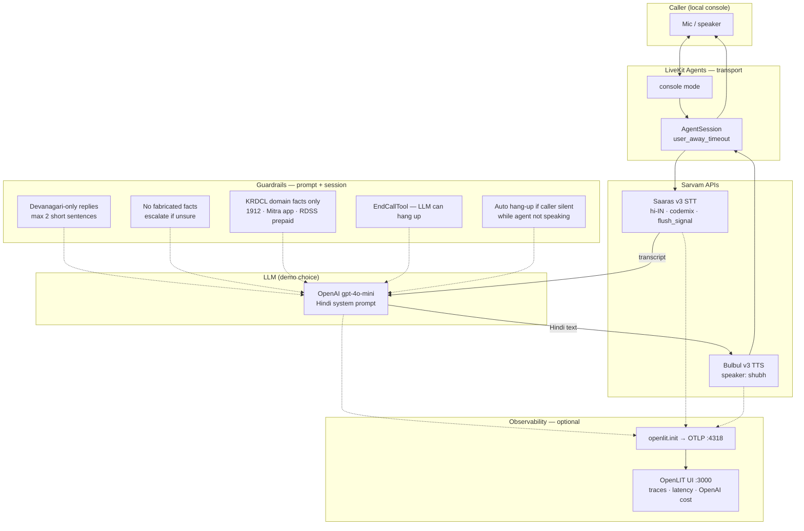

# Sarvam AI — hands-on evaluation for DISCOM / energy policy work

**Context:** I built this repo as part of a take-home for a **GTM strategy role at Sarvam**. Day job context: I work at an **energy policy think tank** with **distribution utilities (DISCOMs)** — tariff orders, billing analytics, Hindi outreach, consumer helplines, RDSS/smart-meter narratives. The point isn’t “does the API return 200?” — it’s **where Sarvam’s products actually help (or don’t) on work I’d realistically ship**.

This is a **working evaluation lab**, not a production system. Everything runs locally; notebooks are self-contained; the voice agent is a **demo console**, not a live phone line (yet).

---

## Overall objective

Map Sarvam’s stack to **five utility-relevant surfaces**:

| # | Surface | Sarvam product | What “good” looks like for my work |
|---|---------|----------------|-----------------------------------|
| **V1** | Scans, charts, tariff pages, Hindi forms | **Document Intelligence** | Faithful OCR + layout; handles Indic scans; honest limits on charts/math |
| **V2** | Consumer / field audio | **Saaras v3 (STT)** | Codemixed Hindi–English; no hallucination on silence; clear API limits |
| **V3** | Policy headlines → Hindi | **Mayura v1** + **Sarvam-Translate v1** | Publishable Devanagari; formal tone; fast enough for newsroom workflow |
| **V4** | Hindi voice helpline (demo) | **Saaras + Bulbul v3** via LiveKit | Natural codemix listening; short Hindi replies; sensible hang-up behaviour |
| **—** | Cost / latency visibility | **OpenLIT** (optional) | Per-turn traces; **OpenAI LLM cost** visible; Sarvam cost gaps documented |

The **active** validations in this repo are the three notebooks + `voice_agent.py`.

---

## Repo layout (what’s actually here)

```
comparison-of-LLM-models/
├── test_images.ipynb          # V1 — Document Intelligence
├── test_STT.ipynb             # V2 — Saaras v3 vs OpenAI STT
├── test_translate.ipynb       # V3 — Mayura / Sarvam-Translate vs Google
├── voice_agent.py             # V4 — KRDCL Hindi voice agent (LiveKit console)
├── test_inputs/               # All custom test media (charts, PDFs, audio, headlines)
├── ground_truth/, human_rating_sheets/   # ancillary reference material (not part of main run path)
├── production_llm_benchmark_stack.ipynb   # Separate GPU LLM bench (Sarvam-M, etc.) — out of scope for GTM demo
├── requirements.txt
├── .env                       # API keys (not committed) — see Setup
└── openlit/                   # Cloned OpenLIT platform for Docker (gitignored)
```

**Outputs** land next to the notebooks when you run cells (`output/`, Gradio inline, printed tables in notebook summaries).

---

## Setup (once)

```bash
cd comparison-of-LLM-models
python -m venv venv
source venv/bin/activate
pip install -r requirements.txt
```

Create `.env` in the repo root (never commit it):

```bash
SARVAM_API_KEY=...
OPENAI_API_KEY=...          # STT baseline + voice agent LLM
GOOGLE_API_KEY=...          # translation baseline (test_translate)
LIVEKIT_URL=...             # voice agent only
LIVEKIT_API_KEY=...
LIVEKIT_API_SECRET=...

# Optional — OpenLIT observability for voice agent
OPENLIT_ENABLED=true
OTEL_EXPORTER_OTLP_ENDPOINT=http://127.0.0.1:4318
```

**OpenLIT dashboard (optional, one-time Docker pull):**

```bash
git clone https://github.com/openlit/openlit.git   # or use ./openlit if already cloned
cd openlit && docker compose up -d
# UI: http://127.0.0.1:3000 — login: user@openlit.io / openlituser (OpenLIT README default)
```

---

## Validation 1 — `test_images.ipynb` (Document Intelligence)

**Objective:** Stress-test **Sarvam Document Intelligence** on the kinds of artifacts I handle at work — **DISCOM charts**, **tariff-style tables**, **Hindi newspaper scans**, **stamped/degraded tables**, **Hinglish handwritten forms**, **math-heavy slides**, and **PDF edge cases**.

**How to run**

1. Cells **3 → 7** once: paths, client, job runner, Gradio viewer.
2. Run any **Image & PDF** section you care about.

**Inputs:** `test_inputs/images to test for text extraction quality/` and `test_inputs/pdfs to test for text extraction quality/`

**Validation axes**

- **OCR fidelity** — characters and numbers correct?
- **Layout** — columns, tables, reading order?
- **Visual reasoning** — charts: axes, series, legends?
- **Indic / multilingual** — pure Hindi scan, codemixed form, handwritten Devanagari?

**What I actually found (summary)**

| Input type | Outcome | Utility takeaway |
|------------|---------|------------------|
| Dense bar charts (plot1, plot2) | **Failed** — invalid/corrupt image errors | Chart → structured data still **not** a drop-in for my analytics pipeline |
| Rotated line chart (plot5) | **Success** — full reconstruction | Promising for **annotated** chart exports |
| Pure Hindi newspaper (plot7) | **Success** | Strong for **regulatory / Hindi document** ingestion |
| Clean table (plot8) | **Success** | Good for **billing / tariff tables** |
| Degraded + stamped table (plot9) | **Partial** | Real-world scans need **human QA** |
| Hinglish handwritten form (plot10) | **Success** | Relevant for **field forms / surveys** |
| Math / pseudo-code (plot11) | **~80% char accuracy** | Not ready for equation-heavy annexures |
| PDF >10 pages (doc1) | **Correct error** | Know the **10-page cap** upfront |
| Highlighted PDF (doc2) | **Success** | Highlights didn’t break extraction |
| Dual-column English PDF (doc3) | Run in notebook | Layout stress test |

**Output:** Gradio — document preview (left), OCR markdown (right).

---

## Validation 2 — `test_STT.ipynb` (Saaras v3 vs OpenAI)

**Objective:** Compare **Sarvam Saaras v3** (all five modes) vs **OpenAI** transcription on audio that looks like **helpline / field** usage — codemixed Hindi–English, pure Hindi, silence, very short clips, **>30s REST limit**, and a longer sample clip.

**How to run**

1. Cells **3 → 7** once: setup, providers, Gradio.
2. Run per-file sections (or your own recordings in `test_inputs/speech recordings/`).

**Sarvam modes tested:** `transcribe` · `translate` · `verbatim` · `translit` · `codemix`

**What each file tests**

| Recording | Tests |
|-----------|--------|
| `STT_codemixed.mp3` | Codemix + **number preservation** (consumer IDs, amounts) |
| `STT_natural_pure_hindi.mp3` | Natural Hindi; compare mode consistency |
| `STT_silence.mp3` | **No hallucination** on noise-only audio |
| `STT_2seconds_empty.mp3` | Ultra-short utterance |
| `STT_english_31seconds_edge_case.mp3` | **>30s fails on Sarvam REST**; OpenAI still works |
| `STTsample_product_refund.mp3` | Longer real-world customer clip |

**Headline results**

- Sarvam is **accurate** on codemix, Hindi, and silence (empty transcript, no garbage).
- **31s clip:** Sarvam correctly errors; OpenAI passes — important for **batch IVR** vs **streaming** product choice.
- Sarvam runs **5 modes per file** → higher latency than a single OpenAI call; for production I’d pick **one mode** (`codemix` for DISCOM helpline).
- For the voice agent I standardized on **`codemix` + `flush_signal`** (see V4).

**Output:** Gradio — audio (left), stacked Sarvam transcripts + OpenAI block (right).

---

## Validation 3 — `test_translate.ipynb` (Mayura / Sarvam-Translate vs Google)

**Objective:** English **policy-style headlines** → Hindi for comms work (think tank briefs, utility social copy). Compare:

- **Mayura v1** — `formal` and `modern-colloquial`
- **Sarvam-Translate v1**
- **Google Translate** (baseline via `deep-translator`)

**How to run**

1. Cells **2 → 5** once.
2. Cell **7** for full batch, or per-headline sections.

**Corpus:** Three headlines in-notebook (coal transition, wind targets, AQI enforcement) — aligned with energy policy themes. Images in `test_inputs/images to test translation/` for visual reference.

**Headline results**

| Provider | Verdict |
|----------|---------|
| **Mayura formal** | **Pass** — publishable Devanagari, good policy vocabulary |
| **Sarvam-Translate v1** | **Pass** — fast (~375ms avg), full Hindi |
| **Mayura colloquial** | **Fail for this use case** — outputs **Hinglish**, not colloquial Hindi |
| **Google Translate** | **Pass** — fluent; ~**3× slower** than Sarvam-translate |

**Cost (rough, from notebook runs):** Mayura ~₹0.35/call · Translate v1 ~₹0.53 · Google ~₹0.30 — all cheap at headline scale; Sarvam wins on **speed + tone control**.

**Output:** Gradio — English (left), Hindi + latency + ₹ estimate (right).

---

## Validation 4 — `voice_agent.py` (KRDCL Hindi voice agent)

**Objective:** End-to-end **“DISCOM helpline”** demo — fictional **KRDCL** (Krishnapur Rajya Distribution Company Limited). Caller asks about **smart prepaid meters**, **billing**, **UPI payment**, **check meter** — agent replies in **short Hindi** with natural **codemix** (bill, UPI, smart meter in Latin where Indians actually say them).

This is the **GTM story** piece: Sarvam owns the **voice layer**; LLM is swappable (I used **GPT-4o-mini** for reliability/cost in the demo).

### Architecture



### Tech stack

| Layer | Choice | Why |
|-------|--------|-----|
| **Runtime** | LiveKit Agents (`dev` + `console`) | Local mic/speaker without SIP; same pattern as production voice bots |
| **STT** | Sarvam **Saaras v3**, `mode=codemix`, `flush_signal=True` | Matches helpline Hindi; endpointing for turn-taking |
| **Turn detection** | `turn_detection="stt"` (no Silero VAD) | Avoids **double VAD** fighting Sarvam |
| **LLM** | OpenAI **gpt-4o-mini** | Short Hindi replies; cheap per turn |
| **TTS** | Sarvam **Bulbul v3**, `shubh` | Natural Hindi voice |
| **Tools** | `EndCallTool` | Model can end call when caller is done |

### Guardrails (what’s actually enforced)

**Prompt-level (SYSTEM_PROMPT)**

- Hindi in **Devanagari**; allowed loanwords (bill, UPI, smart meter, etc.).
- **Max 2 short sentences** per turn — keeps TTS latency and caller comprehension sane.
- **No fabricated data** — “I’ll check and call back” instead of making up balances.
- Scripted **KRDCL facts** (helpline 1912, Mitra app, 1% online rebate, RDSS prepaid benefits, check meter in 48h).
- Conversation flow for **billing / payment / smart meter** intents.

**Session-level (code)**

- `user_away_timeout` + shutdown on `user_state == "away"` — drops call if caller goes **silent** while agent isn’t speaking (default **15s**, env `USER_SILENCE_TIMEOUT_SECONDS`).
- `EndCallTool` — polite closure when caller says they’re done.
- **No SIP / telephony** in this repo — TODO for real outbound/inbound (see docstring).

**Not in scope (honest gaps)**

- No PII redaction layer, no RBAC, no recording consent flow — would need production compliance.
- LLM is **not** Sarvam-M — intentional for this demo; Sarvam voice in/out is the product story.

### Observability (OpenLIT)

- `openlit.init()` runs **before** LiveKit imports when `OPENLIT_ENABLED=true`.
- Traces export to **`http://127.0.0.1:4318`**; UI at **`http://127.0.0.1:3000`**.
- **What shows up:** span tree (`chat gpt-4o-mini`, `tts_node`, `user_turn`, etc.), **OpenAI token/cost** per turn.
- **What doesn’t (document this):** Sarvam TTS/STT spans often show **cost “—”** — OpenLIT toast: *missing provider attribute* (`provider=''`, `model='bulbul:v3'`). **Total trace cost ≈ LLM only**, not full voice pipeline.
- Example short demo (smart meter + prepaid): **total ~$0.00067** — plausible for gpt-4o-mini; **not** inclusive of Sarvam audio pricing.
- Traces are **local/private** — not publicly shareable unless you expose the Docker stack or paste screenshots with redaction.

### How to run

```bash
# Terminal 1
python voice_agent.py dev

# Terminal 2
python voice_agent.py console
```

Talk in Hindi/English mix; try: prepaid smart meter recharge, bill complaint, UPI payment steps.

**TODO in code:** SIP telephony via LiveKit when moving from laptop demo to pilot with a DISCOM.

---

## Voice agent — validation checklist

| Step | Pass criteria |
|------|----------------|
| Worker starts | `dev` prints `[openlit] on` (if enabled) and waits for jobs |
| Console connects | Greeting: *नमस्ते जी, KRDCL helpline…* |
| Codemix STT | Understands “bill”, “smart meter”, “UPI” in mixed speech |
| Hindi replies | Devanagari, ≤2 sentences, on-domain |
| Silence | Call ends after prolonged caller silence (not mid-agent-speech) |
| OpenLIT | Traces visible under service **`krdcl-voice-agent`**; LLM cost populated |

---

## Other files (secondary)

| Asset | Role |
|-------|------|
| `production_llm_benchmark_stack.ipynb` | GPU benchmarking (Sarvam-M, Qwen, Gemma) — **not part of this Sarvam product GTM submission** |

---

## Final outcomes — what I’d tell Sarvam GTM

### Where Sarvam is clearly strong for DISCOM / think-tank work

1. **Document Intelligence** on **Hindi scans, forms, tables, highlighted PDFs** — directly relevant to tariff orders, regulatory filings, and internal MIS.
2. **Saaras codemix STT** for **helpline-shaped audio** — matches how consumers actually speak to discoms.
3. **Bulbul TTS + LiveKit** — credible **Hindi voice agent** demo with sensible turn-taking (`flush_signal`, STT endpointing).
4. **Mayura formal + Sarvam-Translate** for **fast Hindi headline copy** — beats Google on latency; formal mode is on-brand for policy comms.

### Where I’d qualify the pitch

1. **Chart → data** via Doc Intel: **failed** on my densest utility charts — position as *assist + QA*, not autonomous CSV export.
2. **Mayura “colloquial”** on en→hi: produced **Hinglish**, not colloquial Hindi — mode naming / use-case fit needs clarity in GTM materials.
3. **STT REST 30s cap** — streaming/SIP path matters for real IVR; note in enterprise architecture conversations.
4. **OpenLIT / OTEL:** great for **LLM cost** in the voice demo; **Sarvam audio cost** not in dashboard without richer provider attributes / pricing rules.
5. **Voice agent LLM** is third-party in this demo — Sarvam GTM can pair **Sarvam-M / Sarvam-Translate** as the brain in a v2 without changing the voice layer story.

### What I demonstrated end-to-end

A **coherent utility narrative** across Sarvam’s suite:

> **Ingest** messy Hindi/regulatory media (Doc Intel) → **listen** to codemixed callers (Saaras) → **respond** in Hindi voice (Bulbul + agent framework) → **publish** Hindi policy content (Mayura / Translate) — with **traces and per-turn LLM cost** on the voice path for commercial conversations.

That’s the assignment story: not abstract benchmarks, but **CEEW / DISCOM-shaped use cases** with honest limits called out.

---

## Quick reference — Sarvam products ↔ files

| Sarvam product | File | API surface |
|----------------|------|-------------|
| Document Intelligence | `test_images.ipynb` | `document_intelligence.create_job` |
| Saaras v3 STT | `test_STT.ipynb`, `voice_agent.py` | REST STT / LiveKit `sarvam.STT` |
| Bulbul v3 TTS | `voice_agent.py` | LiveKit `sarvam.TTS` |
| Mayura v1 | `test_translate.ipynb` | Translation with `mode=formal` / `modern-colloquial` |
| Sarvam-Translate v1 | `test_translate.ipynb` | `translate` endpoint |

---

## Notes for reviewers

- Default OpenLIT login (`user@openlit.io` / `openlituser`) is from the **[OpenLIT README](https://github.com/openlit/openlit)** — fine for local Docker; rotate/harden before any shared deploy.
- Do **not** commit `.env` or share raw traces publicly (conversation content may appear in spans).
- If the OpenLIT **home dashboard** is empty but **Traces** has data, that’s the known **dashboard seed failure** on first Docker up — use **Traces**, filter **`krdcl-voice-agent`**, last 1h.

---

*Built for Sarvam GTM evaluation — Krishnapur / DISCOM framing is fictional; test artifacts are from real utility-adjacent analytics and policy themes.*
